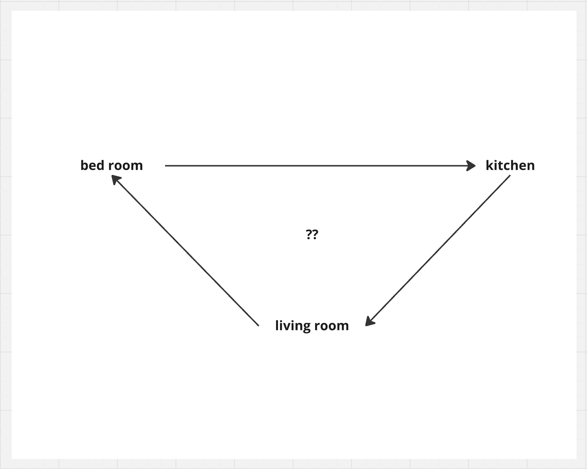
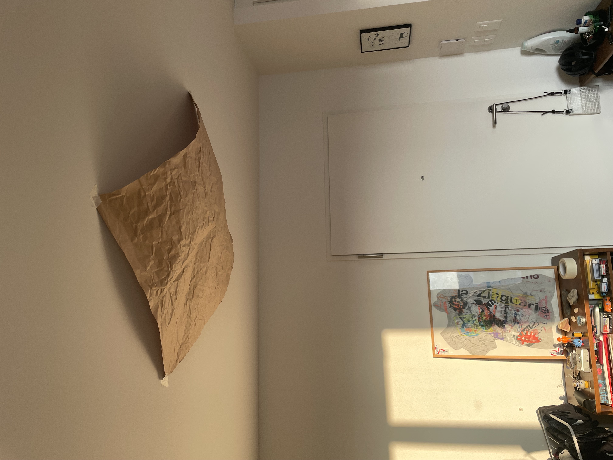
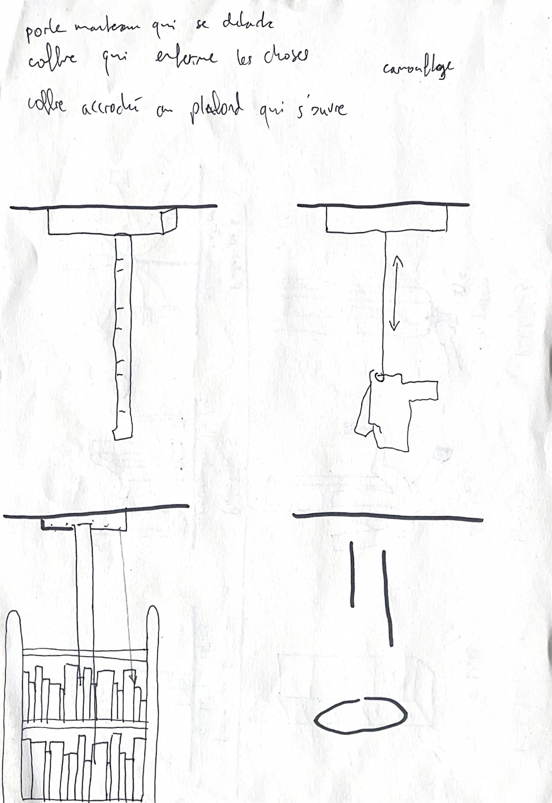
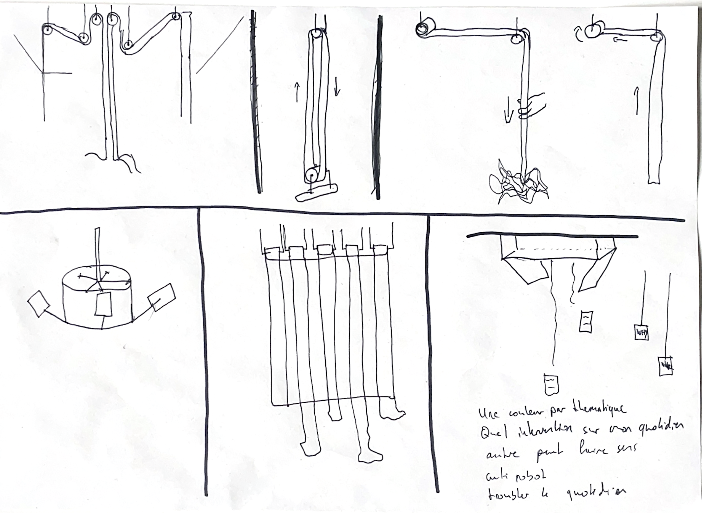

# Antonin Ricou
- Soft Robots
- Master Media Design + O2R

## Area of intervention
Witnessing and catching traces of  life by archiving them through a new time capsule. 
 

## Research Question
What do we left behind us ? 
How and where could we archive it ?
How to create a tool allowing the record of our passage ?
How to habitate the ceiling as a witness space of what is under ?

## Research

Through my research I focus on three main things :

### 1. Time availability

I firstly think about my bookshelf being a physical representation of the time I dont have.

Leading me to ask myself few questions about it :

### 2. Physical traces

Looked about the traces I leave behind myself as a disruptive decoration. 

Something impacting my domestic space as a representation or a souvenirs of my behaviour or presence. An idea of recording my passage as a souvenir or archive.

### 2. Filling space

Through this idea of space I observe my passage and the way I move in my flat as. Living a blank being the middle of my living room.
This remind me this idea of scarecrows being in the middle of a field.

Through this idea of verticality with space around I kept asking myself about the space above me. A ceiling being an available space but oftenly empty.
All those bulb or hole in this inhabitated area. 

Those question lead me to these following keywords :

- Verticality/ horizontality
- Archiving/ recording
- Catching things
- Habitate empty space
- Ceiling as a limit (height)
- Surveillance/ witness
- Time based interaction
- Ungravity

That lead me to draw different sketches about using the ceiling as a starting point :

## Insights
 There is always traces of our passage everywhere

What do we left when we will be gone (for the day/ after death)

Inaccessibility through locking or height as a way of capturing and exposing memories/traces
 
 We never really think about using the ceiling as a disposal space

## Three prototypes

### 1.MEMENTO MORI CALENDAR
A soft robot performing the time passing

#### Summary
Working as a clock of life, this robot spread a roll of paper going from the ceiling to the groundfloor. As a metaphor of the death coming this robot warn the user of the time passing with some indication during the process of time flying. 

#### How does it work ?
The paper going out is already printed delivering message down to the user as the time or any memories of the past through sentence and images.

### 2.The light catcher
A soft robot helping filling your ceiling

#### Summary
Working as a life-things catcher, this soft robot display itself everyday in the middle of your living room (around a bulb) allowing the user to hang stuff on it. 
(still have to decide the rules of it)

#### How does it work ?
The net is going down by the end of the day (timer preset), working a bit as a surprise drop. When the net is down you are allowed to stick things to it as words/sentence/draw. It will then get back to its 2D nature acting as a collection of what you feed it.
By being fixed to the ceiling, you never know when the present will fall down back to you. 

### 3.The Reverse reminder
A soft robot working as a time-capsule creator

#### Summary
This soft robot allows you to  to record things of the life as a time capsule tool creator.
This robot could be perched to a wall or on a table and will be used by people who wants to record a trace of their life.

#### How does it work ?
The paper going out is delivering message trhough a screen down to the user as pre-printed instruction manual. That indicates you how to fill the other roll (blue). Following those instruction the user fill the blue roll and get sealed by the end in a box.

## Next Steps
Pushing the system for catching things from the ceiling 
Thinking how to mix the idea of ceiling as a catcher and how to curate this what is collected.