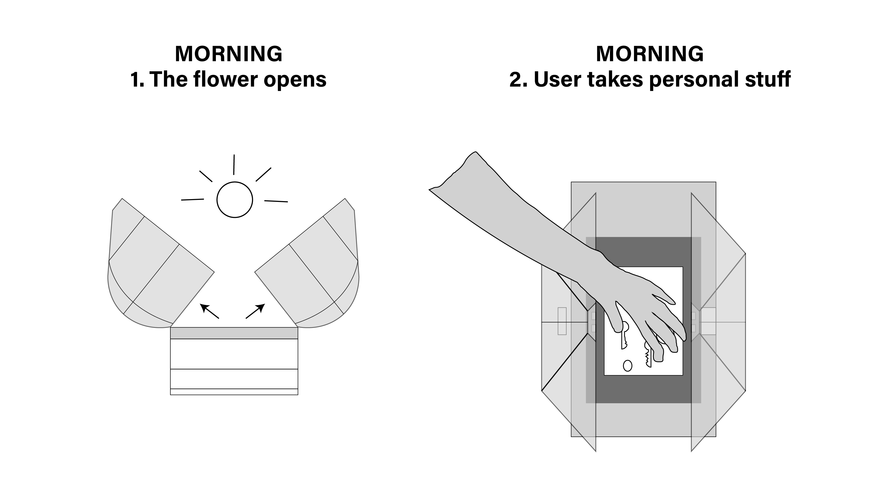
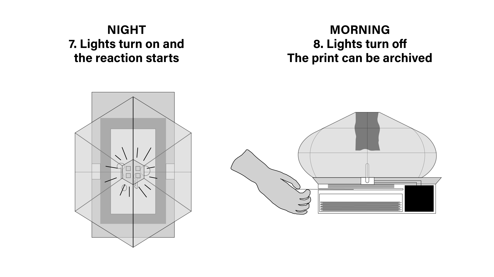

# Antonin Ricou
- Soft Robots
- Master Media Design + O2R

## Troy 
Think a simple, straightforward title, can also be poetic or playful but keep it short. 

## Research Question / area of research
What is the relationship we have with our daily-object we use everyday? In which way do they define our behaviour ? How can they leave traces about our passage ?

## Pitch
A tray recording your presence in a domestic context. Depending of its placement, the interaction will lead to a souvenir or trace of your passage translated by a cyanotype print. 

photo

## Prototyping research
Interested by the time flowing and the traces we leave through our passage, my research took place in this idea of a soft robot allowing the creation of self-archives.
I firstly thought about a robot witnessing the time and our behaviour through material thing.
I look through various form of capsulating daily-object we use in a way of recording them through passive interaction.

### 1. The ceiling as a witness
I firstly thought about the ceiling as the perfect spot witnessing the global space :

#### As a trap witnessing and maybe catching those object to highlight them :

#### As a distributor witnessing the time passing :

### 2. Open/ close system
Then I focus on the system of this idea of traping things through an opening and closing system.
I took inspiration in the nature :

#### System 1. anemon inspiration

#### System 2. venus flytrap inspiration

### 3. Archiving the traces
The third part was about finding a analog way of recording the passage through the objects put inside the tray. Based on this idea of plant, I decided to use the cyanotype technique as a reference to the sun feeding the plant allowing the reaction of photosynthesis.

The idea is to create a space under the robot stocking the paper sheet that will be used for the cyanotype reaction

### 4. Puting everything together
The last part focus on the assembling of all those ideas into my sopft robot going from the technical/ prototypes reflexion but also the scenario through the input/output.
This give place to define more the formal aspect of the robot :

#### Prototype 1

#### Prototype 2

#### Prototype 3

#### 3d model

## Your key prototype
My key prototype result from a mix of all the previous idea allowing a simple interaction with user allowing him/her to use it as a simple tray. 
Through the process, the user can get a traces of its object put inside by the print of a cyanotype.
This lead to the scenario of my soft robot :

## User scenario

### 1st part (the open closing system)
For the formal aspect, I decided to use a mix between a clam and a venus flytrap.

1. In the morning the flaps open allowing the passage of objects in this tray (jewelery/ keys/ coins/ ...)

2. During the day, the clams stay still allowing the user coming fourth and back. Until the end of the day with the personal stuff back

### 2nd part (the recording) 

3. By the night (based on a timer), the clams close indicating to the user to put the paper then the reaction can start.

4. The uv led turn on for a time presetted. The paper reacts to the uv and leaves a trace thanks to to the cyanotype reaction.

### 3rd part (Archiving)
The user can get the print back from the reaction that occurs during the night. It can then archives it somehwehere as distributing it.

## User scenario
1. Morning 
The clams are opening 

2. Day 
User puts things inside 

3. Night 
- Paper put by the user
- Clams are closing 
- Light are turning on
- Light are turning off

4. Morning 
- The clams are opening
- The print can be taken and archived 

## Next Steps
- Keep going the research of new shapes for the clams
- Focusing on the final shapes of the robot
- Starting the electronic part
- Finding way of attracting people to put things inside (visual on the clams)

